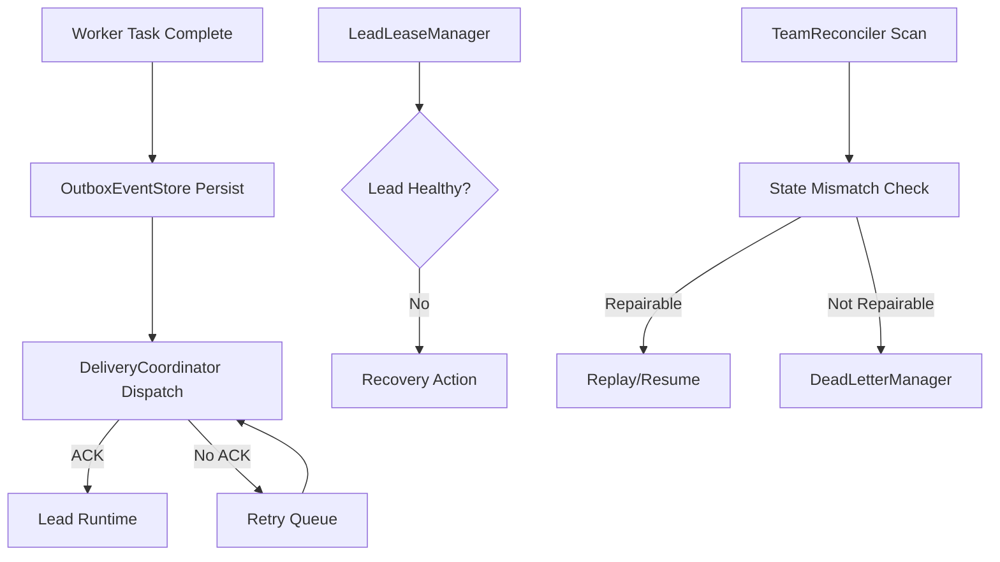

# Design Document

## Overview

本设计实现一个可插拔的“可靠执行增强层”（`Reliability Plugin`），用于保障 `worker -> lead` 完成通知链路在 lead 休眠、短时断连、进程重启等场景下仍可恢复。  
核心原则是“先持久化、后投递、可重放、幂等消费、自动补偿”。

## Steering Document Alignment

### Technical Standards (tech.md)
当前仓库尚未提供 `tech.md`。本设计采用通用分层原则：  
1. `core orchestration` 仅依赖插件接口。  
2. `reliability plugin` 封装事件持久化、重试、看门狗与补偿。  
3. `adapters` 负责接入具体存储/消息系统。

### Project Structure (structure.md)
当前仓库尚未提供 `structure.md`。建议新增目录：
- `src/reliability/interfaces/`：插件对外契约
- `src/reliability/outbox/`：事件持久化与投递
- `src/reliability/lease/`：lead 生命租约与心跳
- `src/reliability/reconciler/`：team 卡死扫描与修复
- `src/reliability/dlq/`：死信队列与人工兜底
- `src/reliability/observability/`：日志、指标、告警

## Code Reuse Analysis

当前仓库暂无业务代码。设计按“新增插件层 + 最小入侵接入点”落地，不依赖现有实现。

### Existing Components to Leverage
- **Orchestration Runtime Hooks**: 在 worker 完成、lead 消费、team stage 变更位置挂接插件回调。
- **Current Logging/Tracing Stack**: 复用现有日志与监控基础设施（若已存在）。

### Integration Points
- **Worker Completion Path**: `onWorkerTaskCompleted`
- **Lead Event Consumption Path**: `onLeadAck`
- **Scheduler/Loop**: `onTick` 用于看门狗扫描
- **Persistence Layer**: durable store（SQL/NoSQL 均可）

## Architecture

### High-level Architecture

1. `OutboxEventStore`: 保存 worker 完成事件，状态机包括 `NEW -> DISPATCHING -> ACKED | RETRYING | DLQ`。  
2. `DeliveryCoordinator`: 负责投递、ACK 跟踪、指数退避重试。  
3. `LeadLeaseManager`: 维护 lead 心跳租约，识别 `healthy/suspected_sleep/unavailable`。  
4. `TeamReconciler`: 周期扫描无进展 team，基于 durable state 修复。  
5. `DeadLetterManager`: 记录无法自动恢复事件，提供操作员处理入口。  
6. `ObservabilityEmitter`: 统一指标、日志、追踪、审计。



### Modular Design Principles
- **Single File Responsibility**: 每个模块仅处理单一职责（如 lease 管理、重试调度）。
- **Component Isolation**: 通过接口注入存储和时钟，减少耦合。
- **Service Layer Separation**: 调度逻辑与存储逻辑分离。
- **Utility Modularity**: 重试策略、超时策略、幂等键生成独立工具化。

## Components and Interfaces

### `ReliabilityPlugin`
- **Purpose:** 插件入口，协调 outbox、lease、reconciler。
- **Interfaces:**
  - `onWorkerTaskCompleted(event)`
  - `onLeadAck(ack)`
  - `onTeamTick(now)`
  - `recover(teamId)`
- **Dependencies:** `OutboxEventStore`, `DeliveryCoordinator`, `LeadLeaseManager`, `TeamReconciler`
- **Reuses:** runtime hook points

### `OutboxEventStore`
- **Purpose:** 持久化 worker 完成事件与投递状态。
- **Interfaces:**
  - `append(event)`
  - `markDispatched(eventId, attempt)`
  - `markAcked(eventId, ackAt)`
  - `fetchPendingByLead(leadId, limit)`
  - `moveToDlq(eventId, reason)`
- **Dependencies:** durable DB
- **Reuses:** existing DB abstraction (if any)

### `LeadLeaseManager`
- **Purpose:** 检测 lead 是否休眠并触发恢复。
- **Interfaces:**
  - `heartbeat(leadId, ts)`
  - `checkStatus(leadId, now)`
  - `triggerRecovery(leadId, reason)`
- **Dependencies:** clock, lease store
- **Reuses:** scheduler

### `TeamReconciler`
- **Purpose:** 扫描 team 卡死并修复状态不一致。
- **Interfaces:**
  - `scanStaleTeams(now)`
  - `reconcile(teamId)`
  - `resume(teamId, checkpoint)`
- **Dependencies:** team state store, outbox store
- **Reuses:** workflow resume API

## Data Models

### `WorkerCompletionEvent`
```ts
type WorkerCompletionEvent = {
  eventId: string;           // globally unique idempotency key
  teamId: string;
  leadId: string;
  workerId: string;
  taskId: string;
  resultRef: string;         // pointer to payload/result artifact
  createdAt: string;         // ISO timestamp
  deliveryState: "NEW" | "DISPATCHING" | "ACKED" | "RETRYING" | "DLQ";
  attemptCount: number;
  nextAttemptAt?: string;
  lastError?: string;
};
```

### `LeadLease`
```ts
type LeadLease = {
  leadId: string;
  lastHeartbeatAt: string;
  leaseExpireAt: string;
  status: "HEALTHY" | "SUSPECTED_SLEEP" | "UNAVAILABLE";
  recoveryInProgress: boolean;
};
```

### `TeamExecutionHealth`
```ts
type TeamExecutionHealth = {
  teamId: string;
  stageId: string;
  lastProgressAt: string;
  pendingEvents: number;
  staleReason?: "NO_ACK" | "LEAD_SLEEP" | "STATE_MISMATCH";
};
```

## Error Handling

### Error Scenarios
1. **Lead 休眠导致无 ACK**
   - **Handling:** 进入重试队列并检查 lead lease；超过阈值触发恢复动作与事件重放。
   - **User Impact:** team 短时延迟但自动恢复，不再永久卡死。

2. **事件重复投递**
   - **Handling:** 基于 `eventId` 做幂等消费，重复事件直接 ACK。
   - **User Impact:** 无重复执行副作用。

3. **恢复失败或多次重试失败**
   - **Handling:** 入 DLQ，触发告警，附带完整上下文（team/lead/event/attempt/error）。
   - **User Impact:** 进入可操作的人工处理通道，而非静默卡死。

4. **存储暂时不可用**
   - **Handling:** 插件拒绝“未持久化即投递”，返回可重试错误，保护一致性。
   - **User Impact:** 任务可能排队，但不会丢事件。

## Testing Strategy

### Unit Testing
- 重试调度策略（指数退避、上限、抖动）
- 幂等处理（重复 eventId）
- lease 状态转换（healthy -> suspected_sleep -> unavailable）
- reconciliation 决策逻辑

### Integration Testing
- worker 完成后 lead 正常 ACK 全链路
- lead 睡眠期间 worker 连续完成事件，恢复后批量重放
- 多 team 并发下 watchdog 扫描与修复准确性
- DLQ 落盘与告警触发

### End-to-End Testing
- 真实执行场景下强制挂起 lead 进程并恢复，验证无永久卡死
- 故障注入：网络抖动、存储延迟、重复消息、乱序消息
- 恢复延迟与成功率基准测试

## Rollout Plan

1. **Phase 1 (MVP)**: Outbox 持久化 + ACK 重试 + 幂等消费。  
2. **Phase 2**: Lead lease + 自动恢复策略。  
3. **Phase 3**: Team watchdog + reconciliation + DLQ。  
4. **Phase 4**: 指标/告警完善与策略调参。

## Operational Metrics (SLO-oriented)

- `event_delivery_ack_rate` (target >= 99.9%)
- `event_retry_count_p95`
- `team_stuck_detect_latency_p95` (target <= 30s)
- `team_auto_recovery_success_rate`
- `dlq_inflow_rate`
